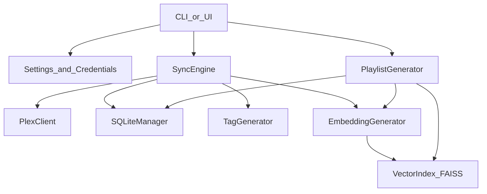

# PlexMix Backend Improvement Plan

## What the "backend" is in this repo

- PlexMix's backend is Python code under [`src/plexmix/`](src/plexmix/) that powers the CLI + Reflex UI.
- Core modules: Plex sync, SQLite database, FAISS vector index, AI providers, embedding generation, playlist creation.
- The CLI (`plexmix`) is the primary entrypoint; the UI calls into the same core modules.

## Current-state findings (high-signal)

### 1) SQLite integrity risk (can create orphaned data)

- Writes use `INSERT OR REPLACE` (e.g. [`SQLiteManager.insert_track`](src/plexmix/database/sqlite_manager.py)), which can **change row IDs** and create **orphaned embeddings / playlist_tracks**.
- Foreign keys aren't explicitly enabled (`PRAGMA foreign_keys=ON` missing).

**Impact**: data corruption, broken relationships, unreliable playlist generation.

### 2) Sync status mismatch (reporting broken)

- DB schema/model uses `status='success'`, but [`SQLiteManager.get_last_sync_time`](src/plexmix/database/sqlite_manager.py) queries `status='completed'`.
- "Last sync" reporting returns wrong/null values.

### 3) Album→artist mapping bug

- Sync tries to infer artist key from `album.plex_key` (numeric ratingKey) or uses `rsplit('/')` on paths.
- Albums often fall back to `artist_id=1` (see [`SyncEngine._detect_library_changes`](src/plexmix/plex/sync.py) + [`PlexClient.extract_album_metadata`](src/plexmix/plex/client.py)).

### 4) Provider/tagging layer inconsistency

- [`TagGenerator._call_ai_provider`](src/plexmix/ai/tag_generator.py) uses provider-specific heuristics that break for Cohere/Claude.
- Tagging prompt has conflicting instructions.
- `print()` statements in [`GeminiProvider`](src/plexmix/ai/gemini_provider.py) ignore `--quiet` flag.

### 5) Performance hotspots (N+1 queries)

- Many N+1 DB lookups in embedding generation and candidate building.
- Affected: [`PlaylistGenerator._get_candidates`](src/plexmix/playlist/generator.py), [`SyncEngine._generate_embeddings_for_new_tracks`](src/plexmix/plex/sync.py).

### 6) CLI create command inconsistency

- `plexmix create` validates AI-provider API keys even though playlist generation only uses embeddings + FAISS.
- See [`src/plexmix/cli/main.py`](src/plexmix/cli/main.py).

---

## Roadmap (prioritized)

### Phase A — Data integrity & schema correctness (highest priority) ✅ COMPLETE

**Goal**: ensure SQLite writes don't corrupt data, foreign keys are enforced, and row IDs remain stable.

**Todos**:

*SQLite Connection Setup:*
- [x] **A.1** Open `src/plexmix/database/sqlite_manager.py` and locate the `connect()` method
- [x] **A.2** Add `PRAGMA foreign_keys=ON` immediately after connection is established
- [x] **A.3** Add `PRAGMA journal_mode=WAL` for better concurrency
- [x] **A.4** Add `PRAGMA busy_timeout=5000` (5 seconds) to handle lock contention

*UPSERT Migration:*
- [x] **A.5** Find `insert_artist()` method — replace `INSERT OR REPLACE` with `INSERT ... ON CONFLICT(plex_key) DO UPDATE`
- [x] **A.6** Find `insert_album()` method — apply same UPSERT pattern using `plex_key` as conflict target
- [x] **A.7** Find `insert_track()` method — apply same UPSERT pattern using `plex_key` as conflict target
- [x] **A.8** Find embedding insert logic — apply UPSERT on `(track_id, model_name)` composite key

*Schema Constraints:*
- [x] **A.9** Check `create_tables()` schema: ensure `plex_key` columns have `UNIQUE` constraint on artists/albums/tracks
- [x] **A.10** Check embeddings table schema: ensure `UNIQUE(track_id, model_name)` constraint exists
- [x] **A.11** Add a migration in `_run_migrations()` if any schema changes are needed for constraints

*Verification:*
- [x] **A.12** Test locally: insert same track twice, verify ID doesn't change
- [x] **A.13** Run `poetry run pytest tests/test_database.py` to ensure no regressions

**Files**:

- [`src/plexmix/database/sqlite_manager.py`](src/plexmix/database/sqlite_manager.py)
- [`src/plexmix/database/models.py`](src/plexmix/database/models.py)

### Phase B — Fix sync correctness bugs ✅ COMPLETE

**Goal**: fix sync status reporting and album→artist mapping.

**Todos**:

*Sync Status Standardization:*
- [x] **B.1** Open `src/plexmix/database/sqlite_manager.py`, find `get_last_sync_time()` method
- [x] **B.2** Check what status value it queries for (likely `status='completed'`)
- [x] **B.3** Search codebase for where sync_history records are inserted — note what status values are used
- [x] **B.4** Standardize on: `success`, `failed`, `interrupted`, `partial`
- [x] **B.5** Update `get_last_sync_time()` to query `status='success'` (or whichever is canonical)
- [x] **B.6** Update all sync_history INSERT statements to use standardized status values
- [x] **B.7** If existing DB has old values, add a migration to update `status='completed'` → `status='success'`
- [x] **B.8** Update `src/plexmix/database/models.py` if there's a status enum/constant defined

*Album→Artist Mapping Fix:*
- [x] **B.9** Open `src/plexmix/plex/client.py`, find `extract_album_metadata()` method
- [x] **B.10** Check if `parentRatingKey` (artist's ratingKey) is being extracted from Plex album object
- [x] **B.11** Add `artist_plex_key` field to the returned album metadata dict (use `album.parentRatingKey`)
- [x] **B.12** Open `src/plexmix/plex/sync.py`, find `_detect_library_changes()` or album processing logic
- [x] **B.13** Remove any `rsplit('/')` logic used to infer artist key from album path
- [x] **B.14** Update album→artist mapping to use the new `artist_plex_key` field
- [x] **B.15** In `SQLiteManager`, ensure album insert/upsert includes `artist_id` lookup by `plex_key`

*Verification:*
- [x] **B.16** Test: sync a library, verify albums are correctly associated (not all pointing to `artist_id=1`)
- [x] **B.17** Add a unit test that inserts a sync record with `status='success'` and verifies `get_last_sync_time()` returns it

**Files**:

- [`src/plexmix/database/sqlite_manager.py`](src/plexmix/database/sqlite_manager.py)
- [`src/plexmix/database/models.py`](src/plexmix/database/models.py)
- [`src/plexmix/plex/client.py`](src/plexmix/plex/client.py)
- [`src/plexmix/plex/sync.py`](src/plexmix/plex/sync.py)

### Phase C — Sync update detection + tag preservation ✅ COMPLETE

**Goal**: detect and sync changes to rating/play_count/last_played; preserve existing tags during updates.

**Todos**:

*Expand Update Detection:*
- [x] **C.1** Open `src/plexmix/plex/sync.py`, find `_track_needs_update()` method
- [x] **C.2** List currently compared fields (likely just title, duration, etc.)
- [x] **C.3** Add comparison for: `rating`, `play_count`, `last_played`, `updated_at`

*Preserve Tags on Update:*
- [x] **C.4** Ensure the UPSERT in `insert_track()` preserves existing `tags`, `environments`, `instruments` columns when not explicitly updated
- [x] **C.5** Modify the UPSERT to use `COALESCE(excluded.tags, tracks.tags)` pattern for preserving existing values

*Verification:*
- [x] **C.6** Test: change a track's rating in Plex, run sync, verify it updates in local DB
- [x] **C.7** Test: verify existing tags aren't wiped when syncing a track update

**Files**:

- [`src/plexmix/plex/sync.py`](src/plexmix/plex/sync.py)
- [`src/plexmix/database/sqlite_manager.py`](src/plexmix/database/sqlite_manager.py)

### Phase D — Provider/tagging reliability ✅ COMPLETE

**Goal**: uniform provider interface; fix Cohere/Claude/OpenAI paths; consistent timeouts/retries.

**Todos**:

*Provider Interface Standardization:*
- [x] **D.1** Open `src/plexmix/ai/base.py`, review `AIProvider` base class
- [x] **D.2** Add abstract method `complete(prompt: str) -> str` if not present
- [x] **D.3** Open `src/plexmix/ai/gemini_provider.py`, implement `complete()` method
- [x] **D.4** Replace any `print()` statements with proper `logging` calls
- [x] **D.5** Open `src/plexmix/ai/openai_provider.py`, implement `complete()` method
- [x] **D.6** Open `src/plexmix/ai/claude_provider.py`, implement `complete()` method
- [x] **D.7** Open `src/plexmix/ai/cohere_provider.py`, implement `complete()` method
- [x] **D.8** Open `src/plexmix/ai/local_provider.py`, implement `complete()` method

*Timeouts & Retries:*
- [x] **D.9** Add consistent timeout parameter (e.g., 30s default) to all provider `complete()` calls
- [x] **D.10** Add exponential backoff retry logic (e.g., 3 retries with 1s, 2s, 4s delays)

*TagGenerator Refactor:*
- [x] **D.11** Open `src/plexmix/ai/tag_generator.py`, find `_call_ai_provider()` method
- [x] **D.12** Refactor to use the new `provider.complete(prompt)` interface
- [x] **D.13** Remove brittle provider-type introspection/heuristics
- [x] **D.14** Review tagging prompt: ensure it requests `tags`, `environments`, `instruments` consistently

*Verification:*
- [x] **D.15** Test each provider (mocked): verify `complete()` returns expected format

**Files**:

- [`src/plexmix/ai/base.py`](src/plexmix/ai/base.py)
- [`src/plexmix/ai/gemini_provider.py`](src/plexmix/ai/gemini_provider.py)
- [`src/plexmix/ai/openai_provider.py`](src/plexmix/ai/openai_provider.py)
- [`src/plexmix/ai/claude_provider.py`](src/plexmix/ai/claude_provider.py)
- [`src/plexmix/ai/cohere_provider.py`](src/plexmix/ai/cohere_provider.py)
- [`src/plexmix/ai/local_provider.py`](src/plexmix/ai/local_provider.py)
- [`src/plexmix/ai/tag_generator.py`](src/plexmix/ai/tag_generator.py)

### Phase E — Performance: query batching & incremental FAISS ✅ COMPLETE

**Goal**: eliminate N+1 queries; avoid full FAISS rebuilds.

**Todos**:

*Bulk Query Methods:*
- [x] **E.1** Open `src/plexmix/database/sqlite_manager.py`
- [x] **E.2** Add `get_tracks_by_ids(ids: List[int]) -> List[Track]` method using `WHERE id IN (?...)`
- [x] **E.3** Add `get_track_details_by_ids(ids: List[int]) -> List[dict]` for enriched track data (with artist/album)
- [x] **E.4** Add `get_albums_by_ids(ids: List[int]) -> List[Album]` method
- [x] **E.5** Add `get_artists_by_ids(ids: List[int]) -> List[Artist]` method

*Refactor N+1 Patterns:*
- [x] **E.6** Open `src/plexmix/playlist/generator.py`, find `_get_candidates()` method
- [x] **E.7** Refactor to use bulk fetch instead of per-track queries
- [x] **E.8** Open `src/plexmix/plex/sync.py`, find embedding generation loop
- [x] **E.9** Refactor to batch-fetch track metadata instead of per-track lookups

*Incremental FAISS Updates:*
- [x] **E.10** Open `src/plexmix/database/vector_index.py`, review `VectorIndex` class
- [x] **E.11** Locate `add_vectors()` method (or add it if missing)
- [x] **E.12** Modify sync to use `add_vectors()` for new tracks instead of `rebuild_index()`
- [x] **E.13** Add an explicit `rebuild_index()` path that can be called when needed (dimension change, corruption)
- [x] **E.14** Improve dimension mismatch handling: detect mismatch, log clear warning, prompt for rebuild

*Indexes:*
- [x] **E.15** Add indexes on frequently filtered columns if missing (check `genre`, `tags` queries)

*Verification:*
- [x] **E.16** Test with larger dataset: measure query count before/after (should see significant reduction)
- [x] **E.17** Test: add 10 tracks, verify FAISS index grows by 10 (not rebuilt from scratch)

**Files**:

- [`src/plexmix/database/sqlite_manager.py`](src/plexmix/database/sqlite_manager.py)
- [`src/plexmix/playlist/generator.py`](src/plexmix/playlist/generator.py)
- [`src/plexmix/plex/sync.py`](src/plexmix/plex/sync.py)
- [`src/plexmix/database/vector_index.py`](src/plexmix/database/vector_index.py)
- [`src/plexmix/utils/embeddings.py`](src/plexmix/utils/embeddings.py)

### Phase F — CLI/UI consistency ✅ COMPLETE

**Goal**: align `plexmix create` with actual pipeline; share code between CLI and UI.

**Todos**:

*Fix CLI Create Command:*
- [x] **F.1** Open `src/plexmix/cli/main.py`, find `create` command
- [x] **F.2** Identify where AI provider API key validation occurs
- [x] **F.3** Determine: does playlist generation actually use AI provider? (Check `PlaylistGenerator`)
- [x] **F.4** If AI is NOT used: remove the API key validation requirement from `create` command
- [x] **F.5** If AI IS used (or should be): document the flow and ensure keys are validated correctly
- [x] **F.6** (Alternative) Add optional `--ai-rerank` flag that enables LLM reranking of FAISS candidates

*Shared Orchestration:*
- [x] **F.7** Identify shared orchestration logic in `main.py` (sync, generate, etc.)
- [x] **F.8** Extract shared functions to a `src/plexmix/services/` module if significant duplication exists with UI states
- [x] **F.9** Update UI states to use shared service functions

*Verification:*
- [x] **F.10** Test both CLI and UI paths: verify same behavior for equivalent operations

**Files**:

- [`src/plexmix/cli/main.py`](src/plexmix/cli/main.py)
- [`src/plexmix/playlist/generator.py`](src/plexmix/playlist/generator.py)
- New: `src/plexmix/services/` (if created)

### Phase G — Regression tests ✅ COMPLETE

**Goal**: add tests proving data integrity, sync correctness, and provider compatibility.

**Todos**:

*Database Integrity Tests:*
- [x] **G.1** Open `tests/test_database.py`
- [x] **G.2** Add test: `test_upsert_keeps_stable_id` — insert track, upsert same plex_key, verify ID unchanged
- [x] **G.3** Add test: `test_foreign_keys_enforced` — try inserting track with non-existent album_id, expect error
- [x] **G.4** Add test: `test_no_orphan_embeddings` — delete track, verify cascade deletes its embeddings
- [x] **G.5** Add test: `test_get_last_sync_time_returns_success_status` — insert sync record, verify query

*Sync Tests:*
- [x] **G.6** Create `tests/test_sync.py` if not exists
- [x] **G.7** Add test: `test_album_artist_mapping` — mock Plex data with known artist/album relationship, verify correct IDs
- [x] **G.8** Add test: `test_track_update_preserves_tags` — insert track with tags, upsert without tags, verify preserved

*Provider Tests:*
- [x] **G.9** Create `tests/test_tagging.py` if not exists
- [x] **G.10** Add test: `test_gemini_provider_complete` — mock Gemini API, verify `complete()` works
- [x] **G.11** Add test: `test_openai_provider_complete` — mock OpenAI API, verify `complete()` works
- [x] **G.12** Add test: `test_cohere_provider_complete` — mock Cohere API, verify `complete()` works
- [x] **G.13** Add test: `test_claude_provider_complete` — mock Claude API, verify `complete()` works

*Final Verification:*
- [x] **G.14** Run full test suite: `poetry run pytest`
- [x] **G.15** Ensure all new tests pass and no existing tests regress

**Files**:

- [`tests/test_database.py`](tests/test_database.py)
- [`tests/test_playlist.py`](tests/test_playlist.py)
- New: `tests/test_sync.py`
- New: `tests/test_tagging.py`

---

## Suggested execution order (fastest confidence first)

1) Phase A (data integrity) + Phase B (sync correctness bugs) ✅

2) Phase C (update detection + tag preservation) ✅

3) Phase D (provider reliability) ✅

4) Phase E (performance) ✅

5) Phase F (CLI/UI consistency) ✅

6) Phase G (regression tests) ✅

---

## Mermaid: current backend flow

---

## Test plan

- Run unit tests (`pytest`) focusing on `tests/test_database.py`, `tests/test_playlist.py`, and new tests for upserts and tagging.
- Manual smoke:
  - `plexmix config test`
  - `plexmix sync` on a small library, verify stats + no orphans
  - `plexmix tags generate` (Gemini/OpenAI/Cohere/Claude if configured)
  - `plexmix create "mood"` with and without remote AI keys (depending on chosen direction)
