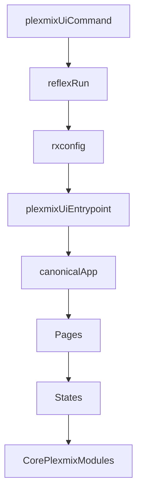

# PlexMix Frontend WebUI Improvement Plan (Reflex)

## What the “frontend” is in this repo

- PlexMix’s WebUI is a **Reflex** app (Python → React), not a JS/Vite/Next frontend.
- The command `plexmix ui` shells out to `reflex run` (see [`src/plexmix/cli/main.py`](src/plexmix/cli/main.py)), so the *effective* Reflex entrypoint is **`rxconfig.py` + `plexmix_ui/plexmix_ui.py`**.

## Current-state findings (high-signal)

### 1) Two competing app entrypoints (causes theme/route/on_load drift)

- Runtime entrypoint (used by `plexmix ui`): [`plexmix_ui/plexmix_ui.py`](plexmix_ui/plexmix_ui.py)
- Alternate app definition (looks intended to be canonical): [`src/plexmix/ui/app.py`](src/plexmix/ui/app.py)
- They disagree on:
  - theme settings (purple vs orange)
  - stylesheets injection (`/styles.css` included in one, absent in the other)
  - page wiring (`dashboard` `on_load` is missing in the runtime entrypoint, compensated by page-level `on_mount`)

**Impact**: hard-to-reason UI behavior and “it looks different depending on how it’s started”.

### 2) A few correctness bugs likely to show up at runtime

- Tagging inline edit inputs reference missing handlers (`set_edit_tags`, `set_edit_environments`, `set_edit_instruments`) in [`src/plexmix/ui/states/tagging_state.py`](src/plexmix/ui/states/tagging_state.py) while used in [`src/plexmix/ui/pages/tagging.py`](src/plexmix/ui/pages/tagging.py).
- Operator precedence bug: `disabled=TaggingState.preview_count == 0 | TaggingState.is_tagging` in [`src/plexmix/ui/pages/tagging.py`](src/plexmix/ui/pages/tagging.py) is parsed incorrectly in Python.
- “Confirm regenerate” dialog cancel doesn’t call `LibraryState.cancel_regenerate_confirm` (state can get stuck) in [`src/plexmix/ui/pages/library.py`](src/plexmix/ui/pages/library.py).

### 3) UX gaps: responsiveness + navigation affordances

- Navbar is fixed-width with fixed layout margin (`200px`) and no active-route highlight: [`src/plexmix/ui/components/navbar.py`](src/plexmix/ui/components/navbar.py).
- Several pages hardcode desktop grid columns/widths (Generator 2-col, Library filter widths), which will feel cramped on smaller screens.

### 4) Settings “tests” are mostly stubs

- `SettingsState.test_ai_provider` and `SettingsState.test_embedding_provider` currently sleep and return success without exercising provider configs: [`src/plexmix/ui/states/settings_state.py`](src/plexmix/ui/states/settings_state.py).

### 5) Visual polish is partially started but not systematized

- Custom CSS exists but is minimal: [`assets/styles.css`](assets/styles.css).
- There is already a focused polish plan: [`plans/frontend-visual-polish-plan.md`](plans/frontend-visual-polish-plan.md).

---

## Roadmap (prioritized)

### Phase A — Stabilize "what runs" (stop the entrypoint drift)

**Goal**: one source of truth for theme/routes/assets/on_load.

**Todos**:

- [ ] **A.1** Review both entrypoints (`plexmix_ui/plexmix_ui.py` and `src/plexmix/ui/app.py`) and document differences in theme, routes, and stylesheets
- [ ] **A.2** Decide canonical location: make `plexmix_ui/plexmix_ui.py` import app from `src/plexmix/ui/app.py` (recommended) or consolidate into one file
- [ ] **A.3** Update `src/plexmix/ui/app.py` to use **orange accent** color (`accent_color="orange"` in theme)
- [ ] **A.4** Ensure `stylesheets=["/styles.css"]` is present in the canonical app definition
- [ ] **A.5** Add `/doctor` route to canonical app if missing (verify all routes match)
- [ ] **A.6** Audit all pages for `on_mount` usage; migrate to `app.add_page(..., on_load=...)` pattern where appropriate
- [ ] **A.7** Remove duplicate `on_mount` calls in `dashboard.py` once `on_load` is wired at app level
- [ ] **A.8** Remove duplicate `on_mount` calls in `doctor.py` once `on_load` is wired at app level
- [ ] **A.9** Test `plexmix ui` command to verify theme, routes, and styles load correctly
- [ ] **A.10** Delete or deprecate the non-canonical entrypoint code (leave only thin wrapper if needed)

**Files**:

- [`rxconfig.py`](rxconfig.py)
- [`plexmix_ui/plexmix_ui.py`](plexmix_ui/plexmix_ui.py)
- [`src/plexmix/ui/app.py`](src/plexmix/ui/app.py)
- Pages currently doing `on_mount` for on_load compensation: [`src/plexmix/ui/pages/dashboard.py`](src/plexmix/ui/pages/dashboard.py), [`src/plexmix/ui/pages/doctor.py`](src/plexmix/ui/pages/doctor.py)

### Phase B — Fix the sharp edges (correctness + predictable UI behavior)

**Goal**: eliminate obvious runtime breakages.

**Todos**:

- [ ] **B.1** Add `set_edit_tags` handler method to `TaggingState` in `tagging_state.py`
- [ ] **B.2** Add `set_edit_environments` handler method to `TaggingState` in `tagging_state.py`
- [ ] **B.3** Add `set_edit_instruments` handler method to `TaggingState` in `tagging_state.py`
- [ ] **B.4** Fix operator precedence bug in `tagging.py`: change `disabled=TaggingState.preview_count == 0 | TaggingState.is_tagging` to `disabled=(TaggingState.preview_count == 0) | TaggingState.is_tagging`
- [ ] **B.5** In `library.py`, wire the regenerate confirm dialog's Cancel button to call `LibraryState.cancel_regenerate_confirm`
- [ ] **B.6** In `library.py`, ensure dialog `on_open_change` also calls `cancel_regenerate_confirm` when closing
- [ ] **B.7** In `track_table.py`, update checkbox `on_change` callbacks to accept optional `checked` value argument (use `*args` or explicit parameter with default)
- [ ] **B.8** Test tagging page inline edit functionality end-to-end
- [ ] **B.9** Test library page regenerate dialog cancel/close behavior
- [ ] **B.10** Test track table checkbox selection with various click patterns

**Files**:

- [`src/plexmix/ui/states/tagging_state.py`](src/plexmix/ui/states/tagging_state.py)
- [`src/plexmix/ui/pages/tagging.py`](src/plexmix/ui/pages/tagging.py)
- [`src/plexmix/ui/pages/library.py`](src/plexmix/ui/pages/library.py)
- [`src/plexmix/ui/components/track_table.py`](src/plexmix/ui/components/track_table.py)

### Phase C — UX + visual consistency (execute and extend your existing polish plan)

**Goal**: a cohesive, professional UI across all pages.

**Todos**:

*Design System Foundation:*
- [ ] **C.1** Review `plans/frontend-visual-polish-plan.md` and extract design tokens (colors, spacing, radius, shadows)
- [ ] **C.2** Add CSS custom properties (variables) to `assets/styles.css` for design tokens
- [ ] **C.3** Add transition utility classes to `assets/styles.css` (e.g., `.transition-colors`, `.transition-all`)
- [ ] **C.4** Define standard spacing values and document usage (e.g., `padding="4"` for compact, `padding="6"` for default)
- [ ] **C.5** Add table styling classes to `assets/styles.css`: hover states, zebra striping, header styles
- [ ] **C.6** Add button variant classes: `.btn-primary`, `.btn-secondary`, `.btn-destructive`

*Navbar Improvements:*
- [ ] **C.7** Add active-route highlight to navbar links (compare current path to link href)
- [ ] **C.8** Add icons to navbar items (use Lucide icons consistent with rest of app)
- [ ] **C.9** Add hover/focus transition effects to navbar links
- [ ] **C.10** Make navbar responsive: collapse to hamburger menu or top bar on small screens
- [ ] **C.11** Add mobile drawer component for collapsed nav state

*Component Polish:*
- [ ] **C.12** Update `progress_modal.py` to use design system tokens
- [ ] **C.13** Update `loading.py` spinner to use consistent styling

*Page-by-Page Touch-ups:*
- [ ] **C.14** Standardize `dashboard.py` spacing and card styling
- [ ] **C.15** Make `generator.py` 2-column layout responsive (stack on mobile)
- [ ] **C.16** Standardize `library.py` filter widths and make responsive
- [ ] **C.17** Apply consistent spacing to `settings.py` form sections
- [ ] **C.18** Standardize `history.py` table styling
- [ ] **C.19** Apply design system to `tagging.py` layout
- [ ] **C.20** Ensure `doctor.py` matches overall design language
- [ ] **C.21** Visual QA pass: check all pages in browser at desktop and mobile widths

**Files**:

- [`assets/styles.css`](assets/styles.css)
- [`src/plexmix/ui/components/navbar.py`](src/plexmix/ui/components/navbar.py)
- [`src/plexmix/ui/components/progress_modal.py`](src/plexmix/ui/components/progress_modal.py)
- [`src/plexmix/ui/components/loading.py`](src/plexmix/ui/components/loading.py)
- Page touch-ups: [`src/plexmix/ui/pages/dashboard.py`](src/plexmix/ui/pages/dashboard.py), [`src/plexmix/ui/pages/generator.py`](src/plexmix/ui/pages/generator.py), [`src/plexmix/ui/pages/library.py`](src/plexmix/ui/pages/library.py), [`src/plexmix/ui/pages/settings.py`](src/plexmix/ui/pages/settings.py), [`src/plexmix/ui/pages/history.py`](src/plexmix/ui/pages/history.py), [`src/plexmix/ui/pages/tagging.py`](src/plexmix/ui/pages/tagging.py), [`src/plexmix/ui/pages/doctor.py`](src/plexmix/ui/pages/doctor.py)

### Phase D — Settings UX: real validation + real “test provider”

**Goal**: Settings becomes a trustworthy control panel.

**Todos**:

*Input Validation:*
- [ ] **D.1** Review existing validation utilities in `validation.py` and identify gaps
- [ ] **D.2** Add validation functions for API key formats (OpenAI, Anthropic, Cohere, Gemini patterns)
- [ ] **D.3** Add validation for URL inputs (local endpoint, embedding endpoint)
- [ ] **D.4** Add state variables in `settings_state.py` for validation error messages per field
- [ ] **D.5** Create `validate_field` handler that updates error state on input change
- [ ] **D.6** Add computed property `is_form_valid` to enable/disable Save button
- [ ] **D.7** In `settings.py`, display inline error messages below invalid inputs
- [ ] **D.8** Disable Test/Save buttons when relevant fields are invalid

*Real Provider Tests:*
- [ ] **D.9** Implement `test_ai_provider` for Gemini: make minimal `generateContent` API call
- [ ] **D.10** Implement `test_ai_provider` for OpenAI: make minimal chat completion call
- [ ] **D.11** Implement `test_ai_provider` for Anthropic: make minimal messages API call
- [ ] **D.12** Implement `test_ai_provider` for Cohere: make minimal generate call
- [ ] **D.13** Implement `test_ai_provider` for local builtin: verify model file exists and loads
- [ ] **D.14** Implement `test_ai_provider` for local endpoint: make health check or simple inference call
- [ ] **D.15** Implement `test_embedding_provider`: generate embedding for "test" string
- [ ] **D.16** Validate embedding dimension matches expected value for selected model
- [ ] **D.17** Display test results with success/failure status and error details
- [ ] **D.18** Add timeout handling for provider tests (don't hang indefinitely)

**Files**:

- [`src/plexmix/ui/utils/validation.py`](src/plexmix/ui/utils/validation.py)
- [`src/plexmix/ui/states/settings_state.py`](src/plexmix/ui/states/settings_state.py)
- [`src/plexmix/ui/pages/settings.py`](src/plexmix/ui/pages/settings.py)

### Phase E — Performance & state hygiene (keep UI smooth on 10k+ tracks)

**Goal**: avoid UI stalls and reduce state complexity.

**Todos**:

*Background Task Standardization:*
- [ ] **E.1** Audit `library_state.py` for blocking `SyncEngine` calls; identify which need backgrounding
- [ ] **E.2** Wrap long-running sync operations in `rx.background` or proper async task pattern
- [ ] **E.3** Audit `tagging_state.py` for blocking tag generation calls
- [ ] **E.4** Ensure tag generation uses consistent background task pattern with cancellation support
- [ ] **E.5** Create shared utility function for running background work with progress callbacks
- [ ] **E.6** Replace ad-hoc `asyncio.create_task` calls with standardized pattern
- [ ] **E.7** Ensure all background tasks properly handle cancellation signals

*Global State Cleanup:*
- [ ] **E.8** Audit `_search_tasks` global in library state; add cleanup on component unmount
- [ ] **E.9** Audit `_sync_cancel_events` global; add cleanup when sync completes or cancels
- [ ] **E.10** Consider moving per-client state to Reflex state classes instead of module globals
- [ ] **E.11** Add cleanup handlers for any remaining globals keyed by client token

*Stats Consistency:*
- [ ] **E.12** Review how Dashboard gets track/library stats (likely from metadata file)
- [ ] **E.13** Review how Doctor gets stats (likely from DB queries)
- [ ] **E.14** Unify stats source: create shared `get_library_stats()` function that queries DB
- [ ] **E.15** Update `app_state.py` to use unified stats function
- [ ] **E.16** Update `doctor_state.py` to use unified stats function (if not already)
- [ ] **E.17** Remove or deprecate metadata file-based stats if no longer needed

*Performance Testing:*
- [ ] **E.18** Test UI responsiveness with 10k+ tracks in library
- [ ] **E.19** Profile and fix any remaining UI stalls during sync/tagging operations

**Files**:

- [`src/plexmix/ui/states/library_state.py`](src/plexmix/ui/states/library_state.py)
- [`src/plexmix/ui/states/tagging_state.py`](src/plexmix/ui/states/tagging_state.py)
- [`src/plexmix/ui/states/app_state.py`](src/plexmix/ui/states/app_state.py)
- [`src/plexmix/ui/states/doctor_state.py`](src/plexmix/ui/states/doctor_state.py)

### Phase F — Quality bar: accessibility + testing

**Goal**: fewer regressions and a more “product-grade” feel.

**Todos**:

*Accessibility:*
- [ ] **F.1** Add visible focus rings to all interactive elements (buttons, links, inputs)
- [ ] **F.2** Ensure navbar is fully keyboard navigable (Tab, Enter, Escape)
- [ ] **F.3** Add keyboard navigation to data tables (arrow keys for row selection)
- [ ] **F.4** Audit icon-only buttons; add `aria-label` or tooltip to each
- [ ] **F.5** Test with screen reader (VoiceOver/NVDA) on key flows
- [ ] **F.6** Check color contrast ratios in dark mode against WCAG AA (4.5:1 for text)
- [ ] **F.7** Fix any contrast issues found in dark mode
- [ ] **F.8** Ensure all form inputs have associated labels
- [ ] **F.9** Add skip-to-main-content link for keyboard users

*Unit Tests:*
- [ ] **F.10** Review existing `test_states.py` coverage; identify untested state handlers
- [ ] **F.11** Add tests for `TaggingState` handlers (including new edit setters from Phase B)
- [ ] **F.12** Add tests for `LibraryState` handlers (sync, regenerate confirm flow)
- [ ] **F.13** Add tests for `SettingsState` handlers (validation, save, test provider)
- [ ] **F.14** Add tests for `DoctorState` handlers
- [ ] **F.15** Add tests for computed properties and derived state

*End-to-End Tests (Optional):*
- [ ] **F.16** Set up Playwright test infrastructure (install, config, first test file)
- [ ] **F.17** Write smoke test: navigate through all main pages
- [ ] **F.18** Write smoke test: generate a playlist (if possible in test env)
- [ ] **F.19** Write smoke test: settings save/load cycle
- [ ] **F.20** Add CI integration for Playwright tests (optional)

**Files**:

- [`tests/ui/test_states.py`](tests/ui/test_states.py)
- All component and page files (for accessibility fixes)
- New: `tests/ui/e2e/` directory for Playwright tests (if implemented)

---

## Suggested execution order (fastest confidence first)

1) Phase A (single entrypoint) + Phase B (bug fixes)

2) Phase C (design system + responsive nav)

3) Phase D (real provider tests + validation)

4) Phase E (perf/state hygiene)

5) Phase F (a11y + tests)

---

## Mermaid: target UI runtime wiring (after Phase A)

