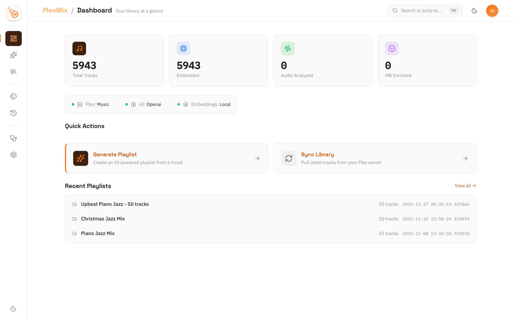
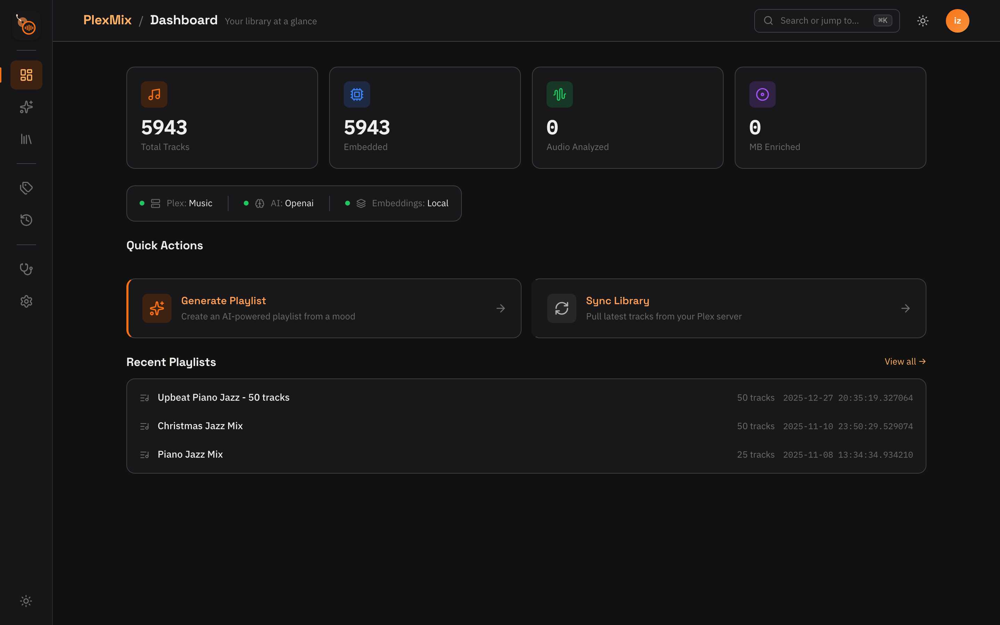
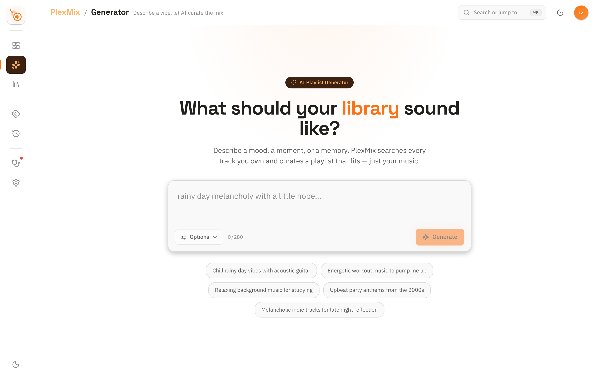
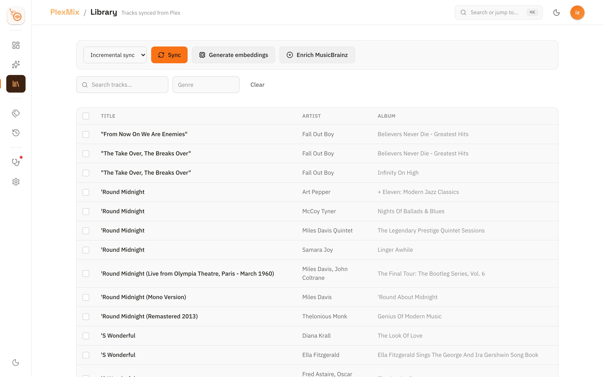
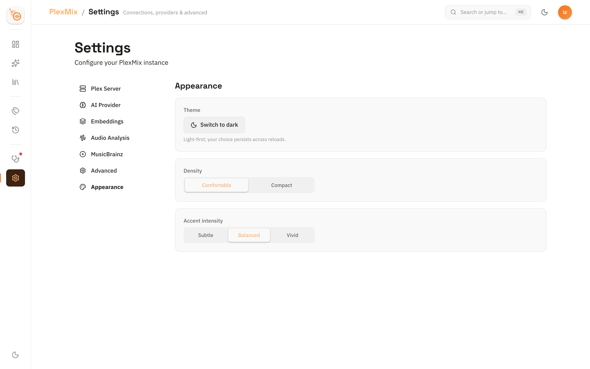

<div align="center">
  

  # PlexMix

  [](https://opensource.org/licenses/MIT)
  [](https://badge.fury.io/py/plexmix)
  [](https://www.python.org/downloads/)

  **AI-powered Plex playlist generator using mood-based queries**
</div>

PlexMix syncs your Plex music library to a local SQLite database, generates semantic embeddings for tracks, and uses AI to create personalized playlists based on mood descriptions.

## Features

- ✨ **Simple Setup** - Only requires a Google API key to get started
- 🎵 **Smart Sync** - Syncs Plex music library with incremental updates
- 🤖 **AI-Powered** - Uses Google Gemini, OpenAI GPT, Anthropic Claude, Cohere Command, or fully local Gemma/Mistral models
- 🔌 **Bring-Your-Own LLM** - Point PlexMix at any OpenAI-compatible local endpoint (Ollama, LM Studio, llama.cpp)
- 🏷️ **AI Tagging** - Automatically generates tags, environments, and instruments for tracks
- 🎵 **Audio Analysis** - Extract tempo, key, energy, danceability via Essentia DSP (optional)
- 🔍 **Semantic Search** - FAISS vector similarity search for intelligent track matching
- 🎨 **Mood-Based** - Generate playlists from natural language descriptions
- ⚡ **Fast** - Local database with optimized indexes and full-text search
- 🎯 **Flexible** - Filter by genre, year, rating, artist, environment, instrument, tempo, energy, key, and danceability
- 🐳 **Docker Ready** - Deploy with Docker Compose for containerized setups
- 🛡️ **Resilient** - Automatic database recovery if deleted or corrupted

## Quick Start

### Option 1: Command Line Interface (Recommended)

```bash
# Install from PyPI
pip install plexmix

# Run setup wizard
plexmix config init

# Sync your Plex library (incremental, generates embeddings automatically)
plexmix sync

# Generate AI tags for tracks (enhances search quality)
plexmix tags generate

# Create a playlist
plexmix create "upbeat morning energy"

# With filters
plexmix create "chill evening vibes" --genre jazz --year-min 2010 --limit 30

# Filter by environment and instrument
plexmix create "focus music" --environment study --instrument piano

# Filter by audio features (requires audio analysis)
plexmix create "dance party" --tempo-min 120 --energy high --danceable 0.7

# Use alternative AI provider
plexmix create "workout motivation" --provider openai

# If you encounter issues (e.g., "0 candidate tracks")
plexmix doctor

# Regenerate all tags and embeddings from scratch (WARNING: destructive)
plexmix sync regenerate
```

### Option 2: Docker

Pre-built multi-platform images (amd64 + arm64) are published to GHCR on every release.

```bash
# Pull the latest image
docker pull ghcr.io/izzoa/plexmix:latest

# Or run with Docker Compose (clone the repo for docker-compose.yml)
git clone https://github.com/izzoa/plexmix.git
cd plexmix
cp .env.example .env
# Edit .env with your PLEX_TOKEN, GOOGLE_API_KEY, etc.
docker compose up -d

# Access the web UI at http://localhost:3000

# Run CLI commands via Docker
docker compose run plexmix sync
docker compose run plexmix create "chill evening vibes"
```

### Option 3: Web User Interface (Alpha)

> **Note:** The Web UI is currently in Alpha status. The CLI is the recommended way to interact with PlexMix for production use.

```bash
# Install with UI extras
pip install "plexmix[ui]"

# Or if using poetry
poetry install -E ui

# Launch the web UI
plexmix ui

# Optional: Specify host and port
plexmix ui --host 0.0.0.0 --port 8000
```

Then open your browser to `http://localhost:3000`

**Password Protection:** Set `PLEXMIX_UI_PASSWORD` to require a password before accessing the UI. This is recommended when binding to `0.0.0.0` or exposing the UI on a network.

```bash
PLEXMIX_UI_PASSWORD=mysecret plexmix ui --host 0.0.0.0
```

#### Screenshots

<div align="center">
  
  
  <p><em>Dashboard with configuration status and library statistics</em></p>
</div>

<div align="center">
  
  <p><em>AI-powered playlist generator with mood-based queries</em></p>
</div>

<div align="center">
  
  <p><em>Browse and manage your music library with advanced filtering</em></p>
</div>

<div align="center">
  
  <p><em>Configure Plex, AI providers, and embeddings</em></p>
</div>

#### Web UI Features

The web interface provides a modern, intuitive way to interact with PlexMix:

- **📊 Dashboard** - Overview of library stats, configuration status, and quick actions
- **⚙️ Settings** - Configure Plex, AI providers, and embeddings with real-time validation
- **📚 Library Manager** - Browse, search, and sync your music library with live progress tracking
- **🎵 Playlist Generator** - Create mood-based playlists with advanced filters and instant preview
- **🏷️ AI Tagging** - Batch generate tags for tracks with progress monitoring
- **📜 Playlist History** - View, export, and manage all generated playlists

#### Key UI Features

- **🌓 Dark/Light Mode** - Toggle between themes with automatic logo switching
- **Real-time Progress** - Live updates for sync, tagging, and generation operations
- **Form Validation** - Instant feedback on configuration settings
- **Loading States** - Skeleton screens and spinners for smooth UX
- **Error Handling** - User-friendly error messages with recovery options
- **Responsive Design** - Works on desktop and tablet devices

## Installation

### From PyPI (Recommended)

```bash
pip install plexmix
```

### From Source

```bash
git clone https://github.com/izzoa/plexmix.git
cd plexmix
poetry install
```

### With Audio Analysis (Optional)

```bash
# Install with Essentia for audio feature extraction
pip install "plexmix[audio]"

# Or with Poetry
poetry install -E audio
```

### With Docker

```bash
# Pre-built image from GHCR
docker pull ghcr.io/izzoa/plexmix:latest

# Or build locally
git clone https://github.com/izzoa/plexmix.git
cd plexmix
docker compose up -d
```

## Configuration

PlexMix uses **Google Gemini by default** for both AI playlist generation and embeddings, requiring only a **single API key**! Credentials can be stored in the system keyring or passed as environment variables.

### Required

- **Plex Server**: URL and authentication token
- **Google API Key** (or **Gemini API Key**): For Gemini AI and embeddings ([Get one here](https://makersuite.google.com/app/apikey))

### Optional Alternative Providers

- **OpenAI API Key**: For GPT models and text-embedding-3-small
- **Anthropic API Key**: For Claude models (AI only, no embeddings)
- **Cohere API Key**: For Command R7B and Embed v4 models
- **Local Embeddings**: sentence-transformers (free, offline, no API key needed)
- **Local LLM**: Run Gemma 3 1B/4B, Liquid LFM 1.2B, Yarn-Mistral 7B-128K, or hook into an Ollama/LM Studio endpoint

### Getting a Plex Token

1. Open Plex Web App
2. Play any media item
3. Click the three dots (...) → Get Info
4. View XML
5. Copy the `X-Plex-Token` from the URL

## Usage

### Configuration Commands

```bash
# Interactive setup wizard
plexmix config init

# Test Plex server connection
plexmix config test

# Show current configuration
plexmix config show
```

**Troubleshooting Connection Issues:**

If you get a "400 Bad Request" error when connecting to Plex:

1. **Check your Plex token** - Make sure there are no extra spaces when copying
2. **Try HTTPS** - Use `https://` instead of `http://` if your server requires secure connections
3. **Verify the URL** - Ensure the server address and port (default: 32400) are correct
4. **Check server settings** - In Plex Server settings, look for network/authentication requirements
5. **Test the connection** - Run `plexmix config test` to diagnose the issue

**Common Plex Server URLs:**
- Local: `http://localhost:32400`
- Remote: `http://192.168.1.X:32400` (replace X with your server's IP)
- Secure: `https://your-server:32400`

### Sync Commands

PlexMix offers three sync modes:

```bash
# Incremental sync (default) - Only syncs new/changed/deleted tracks
plexmix sync

# Same as above, but explicit
plexmix sync incremental

# Sync with audio feature analysis (requires essentia)
plexmix sync --audio

# Regenerate everything from scratch (WARNING: Deletes ALL tags and embeddings)
plexmix sync regenerate

# Legacy alias for incremental sync
plexmix sync full

# Sync without embeddings (faster, but you'll need to generate them later)
plexmix sync --no-embeddings
```

**Sync Mode Comparison:**

| Mode | Tracks | Tags | Embeddings | Use Case |
|------|--------|------|------------|----------|
| `incremental` (default) | ✅ Syncs changes only | ✅ Preserves existing | ✅ Preserves existing | Regular updates, new tracks added |
| `incremental --audio` | ✅ Syncs changes only | ✅ Preserves existing | ✅ Preserves existing | Sync + audio feature analysis |
| `full` (alias) | ✅ Syncs changes only | ✅ Preserves existing | ✅ Preserves existing | Same as incremental (kept for compatibility) |
| `regenerate` | ✅ Syncs everything | ⚠️ **DELETES ALL** | ⚠️ **DELETES ALL** | Starting fresh, fixing corrupt data |

**When to use each:**
- **`plexmix sync`** → Default for daily use, adding new music
- **`plexmix sync regenerate`** → When you want to completely regenerate all AI data (tags, embeddings)

### Database Health Check

```bash
# Diagnose and fix database issues
plexmix doctor

# Force regenerate all tags and embeddings (DEPRECATED: use 'plexmix sync regenerate' instead)
plexmix doctor --force
```

**What does `plexmix doctor` do?**
- Detects orphaned embeddings (embeddings that reference deleted tracks)
- Shows database health status (track count, embeddings, orphans)
- Interactively removes orphaned data
- Regenerates missing embeddings
- Rebuilds vector index

**When to use:**
- After "No tracks found matching criteria" errors
- When playlist generation finds 0 candidates
- After database corruption or manual track deletion
- Periodic maintenance to keep database healthy

**Note:** For complete regeneration of all tags and embeddings, use `plexmix sync regenerate` instead of `doctor --force`

### Database Management

```bash
# Show database information and statistics
plexmix db info

# Reset database and embeddings (with automatic backup)
plexmix db reset

# Reset without backup (not recommended)
plexmix db reset --no-backup

# Skip confirmation prompt
plexmix db reset --force
```

**What gets deleted:**
- SQLite database (`~/.plexmix/plexmix.db`)
- FAISS embeddings index (`~/.plexmix/embeddings.index`)
- All synced music metadata
- User-applied tags (moods, environments, instruments)
- Playlist history
- AI-generated embeddings

**What gets preserved:**
- Your music files on Plex server (unchanged)
- Plex server metadata (unchanged)
- PlexMix configuration (`.env`, `config.yaml`)
- API keys

**When to use:**
- Complete fresh start
- Switching embedding providers
- Database corruption that `doctor` can't fix
- Testing or development

**After reset:**
1. Run `plexmix sync` to re-sync your library
2. (Optional) Run `plexmix tags generate` to re-tag tracks

By default, a timestamped backup is created in `~/.plexmix/backups/` before deletion.

**Database Command Reference:**

| Command | Purpose | When to Use |
|---------|---------|-------------|
| `plexmix db info` | Show database stats | Check database health, view track/embedding counts |
| `plexmix db reset` | Delete and reset database | Fresh start, switching providers, unfixable corruption |
| `plexmix sync` | Incremental sync | Regular updates, new tracks |
| `plexmix sync regenerate` | Regenerate all data | Regenerate tags/embeddings, fix data quality |
| `plexmix doctor` | Fix orphaned data | After errors, periodic maintenance |

### Tag Generation

```bash
# Generate AI tags for all untagged tracks
plexmix tags generate

# Use alternative AI provider
plexmix tags generate --provider openai

# Use the offline/local provider
plexmix tags generate --provider local

# Skip embedding regeneration (faster, but tags won't be in search)
plexmix tags generate --no-regenerate-embeddings
```

### Embedding Generation

```bash
# Generate embeddings for tracks without them
plexmix embeddings generate

# Regenerate all embeddings from scratch
plexmix embeddings generate --regenerate
```

**What are tags?**
AI-generated metadata (per track) that enhances semantic search:
- **Tags** (3-5): Mood descriptors like energetic, melancholic, upbeat, chill, intense
- **Environments** (1-3): Best-fit contexts like work, study, focus, relax, party, workout, sleep, driving, social
- **Instruments** (1-3): Most prominent instruments like piano, guitar, saxophone, drums, bass, synth, vocals, strings

All metadata is automatically included in embeddings for more accurate mood-based playlist generation.

### Audio Feature Analysis (Optional)

PlexMix can extract DSP-level audio features from your tracks using [Essentia](https://essentia.upf.edu/). This enriches embeddings and enables audio-aware playlist filters.

```bash
# Install with audio support
pip install "plexmix[audio]"

# Analyze all tracks that don't have audio features yet
plexmix audio analyze

# Re-analyze all tracks (overwrites existing features)
plexmix audio analyze --force

# Show audio analysis statistics
plexmix audio info

# Analyze during sync
plexmix sync --audio
```

**Extracted features:**
- **Tempo** (BPM) with confidence score
- **Key & Scale** (e.g., C major, A minor)
- **Energy Level** (low / medium / high)
- **Danceability** (0.0 - 1.0)
- **Loudness** (dB)
- **Spectral Centroid** and **Zero Crossing Rate**
- **MFCCs** (13-coefficient timbral fingerprint)

Audio features are automatically incorporated into embeddings for richer semantic search and can be used as playlist filters (see below).

### Playlist Generation

```bash
# Basic playlist (prompts for track count)
plexmix create "happy upbeat summer vibes"

# Specify track count
plexmix create "rainy day melancholy" --limit 25

# Filter by genre
plexmix create "energetic workout" --genre rock --limit 40

# Filter by year range
plexmix create "90s nostalgia" --year-min 1990 --year-max 1999

# Filter by environment (work, study, focus, relax, party, workout, sleep, driving, social)
plexmix create "workout energy" --environment workout

# Filter by instrument (piano, guitar, saxophone, drums, etc.)
plexmix create "piano jazz" --instrument piano

# Use specific AI provider
plexmix create "chill study session" --provider claude

# Force the offline/local provider
plexmix create "ambient focus" --provider local

# Filter by audio features (requires audio analysis)
plexmix create "high energy dance" --tempo-min 120 --tempo-max 140
plexmix create "chill lounge" --energy low
plexmix create "piano ballads in C major" --key C --instrument piano
plexmix create "dance floor bangers" --danceable 0.7

# Custom playlist name
plexmix create "morning coffee" --name "Perfect Morning Mix"

# Adjust candidate pool multiplier (default: 25x playlist length)
plexmix create "diverse mix" --limit 20 --pool-multiplier 50

# Don't create in Plex (save locally only)
plexmix create "test playlist" --no-create-in-plex
```

## Architecture

PlexMix uses a multi-stage pipeline for intelligent playlist generation:

1. **AI Tagging** (One-time setup) → Tracks receive:
   - 3-5 descriptive tags (mood, energy, tempo, emotion)
   - 1-3 environments (work, study, focus, relax, party, workout, sleep, driving, social)
   - 1-3 instruments (piano, guitar, saxophone, drums, bass, synth, vocals, strings, etc.)

2. **Audio Analysis** (Optional) → Tracks receive DSP features:
   - Tempo (BPM), key, scale, energy level, danceability, loudness, spectral features, MFCCs

3. **Playlist Generation Pipeline**:
   - **SQL Filters** → Apply optional filters (genre, year, rating, artist, environment, instrument, tempo, energy, key, danceability)
   - **Candidate Pool** → Search using FAISS vector similarity (default: 25x playlist length)
   - **Diversity Selection** → Apply algorithmic diversity rules:
     - Max 3 tracks per artist
     - Max 2 tracks per album
     - No duplicate track/artist combinations
   - **Final Playlist** → Return curated, diverse track list

### Technology Stack

- **Language**: Python 3.10+
- **CLI**: Typer with Rich console output
- **Database**: SQLite with FTS5 full-text search
- **Vector Search**: FAISS (CPU) with cosine similarity
- **AI Providers**: Google Gemini (default), OpenAI GPT, Anthropic Claude, Cohere, Local Gemma/Yarn presets or any OpenAI-compatible endpoint
- **Embeddings**: Google Gemini (3072d), OpenAI (1536d), Cohere (1024d), Local (384-768d)
- **Audio Analysis**: Essentia (optional) for DSP feature extraction
- **Plex Integration**: PlexAPI
- **Deployment**: Docker & Docker Compose support

### Project Structure

```
plexmix/
├── src/plexmix/
│   ├── ai/               # AI provider implementations
│   │   ├── base.py       # Abstract base class
│   │   ├── gemini_provider.py
│   │   ├── openai_provider.py
│   │   ├── claude_provider.py
│   │   ├── cohere_provider.py
│   │   ├── local_provider.py   # Managed Hugging Face + custom endpoint support
│   │   └── tag_generator.py  # AI-based tag generation
│   ├── audio/            # Audio feature analysis (optional)
│   │   └── analyzer.py   # Essentia-based DSP feature extraction
│   ├── cli/              # Command-line interface
│   │   └── main.py       # Typer CLI app
│   ├── config/           # Configuration management
│   │   ├── settings.py   # Pydantic settings
│   │   └── credentials.py # Keyring + env var credential storage
│   ├── database/         # Database layer
│   │   ├── models.py     # Pydantic models
│   │   ├── sqlite_manager.py # SQLite CRUD (incl. audio_features)
│   │   └── vector_index.py   # FAISS index
│   ├── plex/             # Plex integration
│   │   ├── client.py     # PlexAPI wrapper (extracts file paths)
│   │   └── sync.py       # Sync engine (audio-aware embeddings)
│   ├── playlist/         # Playlist generation
│   │   └── generator.py  # Core generation logic (audio filters)
│   ├── ui/               # Web UI (Reflex)
│   │   ├── app.py        # Main Reflex app
│   │   ├── pages/        # UI pages
│   │   ├── states/       # State management
│   │   ├── components/   # Reusable components
│   │   └── utils/        # UI utilities
│   └── utils/            # Utilities
│       ├── embeddings.py # Embedding providers (audio-enriched)
│       └── logging.py    # Logging setup
├── Dockerfile            # Container image definition
├── docker-compose.yml    # Multi-service orchestration
└── tests/                # Test suite
    └── ui/               # UI tests
```

## Database Schema

PlexMix stores all music metadata locally:

- **artists**: Artist information
- **albums**: Album details with artist relationships
- **tracks**: Track metadata with full-text search, AI-generated tags (3-5), environments (1-3), and instruments (1-3)
- **embeddings**: Vector embeddings for semantic search (includes all AI-generated metadata + audio features)
- **audio_features**: DSP-extracted features per track (tempo, key, scale, energy, danceability, loudness, spectral centroid, MFCCs, zero crossing rate)
- **playlists**: Generated playlist metadata
- **sync_history**: Synchronization audit log

## AI Provider Comparison

| Provider | Model | Context Window | Default Temp | Speed | Quality | Cost | Best For |
|----------|-------|----------------|--------------|-------|---------|------|----------|
| OpenAI | gpt-5-mini | 400K tokens | 0.7 | ⚡⚡ Moderate | ⭐⭐⭐⭐⭐ Outstanding | 💰💰 Medium | High-quality responses, reasoning |
| Anthropic | claude-sonnet-4-5 | 200K tokens | 0.7 | ⚡⚡ Moderate | ⭐⭐⭐⭐⭐ Outstanding | 💰💰💰 High | Advanced reasoning, analysis |
| Cohere | command-r-plus-08-2024 | 128K tokens | 0.3 | ⚡⚡ Moderate | ⭐⭐⭐⭐⭐ Outstanding | 💰💰 Medium | Multilingual, complex tasks |
| **Google Gemini** ⭐ | gemini-2.5-flash | 1M tokens | 0.7 | ⚡⚡⚡ Fast | ⭐⭐⭐⭐ Excellent | 💰 Low | General use, RAG, large contexts |
| OpenAI | gpt-5-nano | 400K tokens | 0.7 | ⚡⚡⚡ Fast | ⭐⭐⭐⭐ Excellent | 💰 Low | Speed-optimized, efficient |
| Cohere | command-r7b-12-2024 | 128K tokens | 0.3 | ⚡⚡⚡ Fast | ⭐⭐⭐⭐ Excellent | 💰 Low | RAG, tool use, agents |
| Cohere | command-r-08-2024 | 128K tokens | 0.3 | ⚡⚡⚡ Fast | ⭐⭐⭐⭐ Excellent | 💰 Low | Balanced performance |
| Anthropic | claude-haiku-4-5 | 200K tokens | 0.7 | ⚡⚡⚡ Fast | ⭐⭐⭐⭐ Excellent | 💰 Low | Fast responses, efficiency |

**Legend:**
- ⭐ Default/recommended option
- Speed: ⚡ Slow, ⚡⚡ Moderate, ⚡⚡⚡ Fast
- Quality: ⭐ Basic → ⭐⭐⭐⭐⭐ Outstanding
- Cost: 💰 Low, 💰💰 Medium, 💰💰💰 High

## Embedding Provider Comparison

| Provider | Model | Dimensions | Quality | Speed | Cost | API Key | Best For |
|----------|-------|------------|---------|-------|------|---------|----------|
| **Google Gemini** ⭐ | gemini-embedding-001 | 3072 | ⭐⭐⭐⭐⭐ Outstanding | ⚡⚡ Moderate | 💰 Low | Required | High-dimensional, accurate semantic search |
| Local | mixedbread-ai/mxbai-embed-large-v1 | 1024 | ⭐⭐⭐⭐ Excellent | ⚡⚡ Moderate | 💰 Free | None | Highest-quality offline retrieval when you can store larger vectors |
| Local | google/embeddinggemma-300m | 768 (Matryoshka) | ⭐⭐⭐⭐ Excellent | ⚡⚡ Fast | 💰 Free | None | Flexible local embeddings with truncation to 128/256/512d |
| Cohere | embed-v4 | 256/512/1024/1536 | ⭐⭐⭐⭐ Excellent | ⚡⚡⚡ Fast | 💰 Low | Required | Flexible dimensions (Matryoshka), multimodal |
| OpenAI | text-embedding-3-small | 1536 | ⭐⭐⭐⭐ Excellent | ⚡⚡⚡ Fast | 💰💰 Medium | Required | Balanced performance, OpenAI ecosystem |
| Local | nomic-ai/nomic-embed-text-v1.5 | 768 (Matryoshka) | ⭐⭐⭐ Excellent | ⚡⚡ Fast | 💰 Free | None | Open-source local embeddings with Matryoshka support |
| Local | sentence-transformers/all-MiniLM-L6-v2 | 384 | ⭐⭐⭐ Good | ⚡⚡⚡ Fast | 💰 Free | None | Offline use on modest hardware |

**Key Features:**
- **Gemini**: Highest dimensions (3072d) for maximum semantic precision
- **OpenAI**: Industry standard, excellent ecosystem integration
- **Cohere**: Configurable dimensions (256/512/1024/1536), supports images with v4
- **Local**: Completely free, offline, private, no internet required, with multiple Hugging Face options (MiniLM, MXBAI, EmbeddingGemma, Nomic) to balance speed vs. recall

\* EmbeddingGemma and Nomic embeddings support Matryoshka truncation if you need smaller vectors (128/256/512d) without retraining.

#### How the “Local” Provider Works

When you choose `local` on the Settings page, PlexMix instantiates the selected Hugging Face `sentence-transformers` model directly in-process—no HTTP endpoints, API keys, or port configuration are needed. The model weights download once into your Hugging Face cache (e.g., `~/.cache/huggingface`) and subsequent embedding calls run entirely on your machine, which keeps everything offline and private.

Set `PLEXMIX_LOCAL_EMBEDDING_DEVICE` (default `cpu`) if you want to force a specific device (e.g., `cpu` to avoid macOS MPS instability, or `cuda` when running on a GPU server). The UI and CLI will reuse that cached model/device combination whenever local embeddings are needed.

### Local LLM Presets & Custom Endpoints

You can now generate playlists with fully local LLMs—no outbound network traffic required. The AI tab in the UI (or `plexmix config init`) lets you choose between:

- **Managed downloads** (same workflow as local embeddings) with curated Hugging Face repos:
  - `google/gemma-3-1b` — fast, CPU-friendly drafts (8K context / ~768 new tokens)
  - `liquid/lfm2-1.2b` — lightweight music-focused reasoning (32K context)
  - `google/gemma-3-4b` — higher-quality 4B param model (32K context)
  - `NousResearch/Yarn-Mistral-7b-128k` — 7B param 128K context for huge playlists (GPU recommended)
- **Custom endpoints** that speak the OpenAI Chat Completions API (Ollama, LM Studio, llama.cpp server, OpenRouter running on your LAN, etc.)

When you select "Local (Offline)" as the AI provider you can toggle between **Managed (Downloaded)** and **Custom Endpoint** modes:

1. **Managed (Downloaded)**
   - Click *Download / Warm Up Model* to prefetch weights into your Hugging Face cache
   - Models are loaded in a background worker and reused across tagging/playlist runs
   - Set `PLEXMIX_LOCAL_LLM_DEVICE` to `cpu`, `cuda`, or `mps` to force device placement (defaults to `auto`)

2. **Custom Endpoint**
   - Point PlexMix at any OpenAI-compatible URL (e.g., `http://localhost:11434/v1/chat/completions` for Ollama)
   - Optionally provide a bearer token; PlexMix will include it as `Authorization: Bearer <token>`
   - Responses must return a JSON payload with `choices[0].message.content`

From the CLI you can force the local provider as well:

```bash
# Use the configured local model for tagging
plexmix tags generate --provider local

# Run the playlist doctor flow with your offline LLM
plexmix doctor --force
```

If you ever want to nuke cached weights, delete the relevant directories under `~/.cache/huggingface`.

**Dimension Trade-offs:**
- Higher dimensions = Better semantic understanding but larger storage
- Lower dimensions = Faster search but slightly less accurate
- Cohere's Matryoshka embeddings allow dynamic dimension selection

## Optimal Setup

### Online (Best Latency & Reasoning)

- **AI Provider:** `gemini-2.5-flash` (default). For more advanced reasoning, upgrade to `gpt-5-mini` or `claude-sonnet-4-5` if you have the budget.
- **Embeddings:** `gemini-embedding-001` for maximum semantic precision, or `text-embedding-3-small` if you want faster generation with a slightly smaller vector size.
- **Network Tips:** Keep API keys in `~/.plexmix/credentials` and run `plexmix config init` to verify connectivity. Use `plexmix ui --reload` during development to check the status cards.

### Hybrid (Cloud AI + Local Embeddings)

- **AI Provider:** Keep using `gemini-2.5-flash` (or `gpt-5-mini`) for playlist prompts so you get the latest reasoning updates.
- **Embeddings:** Run `mixedbread-ai/mxbai-embed-large-v1` locally so FAISS never leaves your machine while still benefiting from high-quality vectors.
- **Workflow Tips:** Regenerate embeddings locally after every sync, but keep the AI provider online. This gives you the best of both worlds—fast semantic search without exposing track metadata, plus cloud-scale LLM quality.

### Fully Local (Offline-Friendly)

- **AI Provider:** `OpenRouter` (planned) or a self-hosted LLM (future). Until then, use Gemini with cached responses if you need to stay mostly offline.
- **Embeddings:** `mixedbread-ai/mxbai-embed-large-v1` (1024d) for the best similarity recall while keeping everything on disk.
- **Device:** Set `PLEXMIX_LOCAL_EMBEDDING_DEVICE=cpu` (or `cuda` if you have a local GPU) so sentence-transformers always uses the right hardware.
- **Storage Tips:** Keep FAISS index on SSD (`~/.plexmix/embeddings.index`) and prune unused tracks to reduce RAM usage when generating playlists.

## Docker Deployment

PlexMix publishes multi-platform Docker images (amd64 + arm64) to GitHub Container Registry on every release.

### Quick Start

```bash
# Option A: Use the pre-built image
docker pull ghcr.io/izzoa/plexmix:latest

# Option B: Use Docker Compose (clone repo for compose file)
cp .env.example .env
# Edit .env with your credentials (PLEX_TOKEN, GOOGLE_API_KEY, etc.)
docker compose up -d
```

### Sample `docker-compose.yml`

```yaml
services:
  plexmix:
    image: ghcr.io/izzoa/plexmix:latest
    ports:
      - "3000:3000"   # Web UI
      - "8000:8000"   # Reflex backend
    volumes:
      - plexmix-data:/data
      # Mount your music library read-only for audio analysis
      # - /path/to/music:/music:ro
    environment:
      - PLEX_URL=http://host.docker.internal:32400
      - PLEX_TOKEN=${PLEX_TOKEN}
      - GOOGLE_API_KEY=${GOOGLE_API_KEY:-}
      # Optional alternative AI providers
      # - OPENAI_API_KEY=${OPENAI_API_KEY:-}
      # - ANTHROPIC_API_KEY=${ANTHROPIC_API_KEY:-}
      # - COHERE_API_KEY=${COHERE_API_KEY:-}
      # Optional: protect the web UI with a password
      # - PLEXMIX_UI_PASSWORD=changeme
      # Audio path remapping (translate Plex paths → container paths)
      # - AUDIO_PATH_PREFIX_FROM=/data/music
      # - AUDIO_PATH_PREFIX_TO=/music
    restart: unless-stopped

volumes:
  plexmix-data:
```

### Environment Variables

All credentials can be passed as environment variables (no keyring required in containers):

| Variable | Description |
|----------|-------------|
| `PLEX_URL` | Plex server URL (default: `http://host.docker.internal:32400`) |
| `PLEX_TOKEN` | Plex authentication token |
| `GOOGLE_API_KEY` / `GEMINI_API_KEY` | Google Gemini API key |
| `OPENAI_API_KEY` | OpenAI API key (optional) |
| `ANTHROPIC_API_KEY` | Anthropic API key (optional) |
| `COHERE_API_KEY` | Cohere API key (optional) |
| `PLEXMIX_DATA_DIR` | Data directory override (default: `/data` in Docker, `~/.plexmix` locally) |
| `PLEXMIX_UI_HOST` | UI bind address (default: `0.0.0.0` in Docker, `127.0.0.1` locally) |
| `PLEXMIX_UI_PASSWORD` | Optional password to protect the web UI |
| `AUDIO_ENABLED` | Enable audio analysis (default: `false`) |
| `AUDIO_ANALYZE_ON_SYNC` | Run audio analysis during sync (default: `false`) |
| `AUDIO_PATH_PREFIX_FROM` | Plex file path prefix to replace (for path remapping) |
| `AUDIO_PATH_PREFIX_TO` | Local file path prefix replacement (for path remapping) |

### Running CLI Commands

```bash
# Sync library
docker compose run plexmix sync

# Generate tags
docker compose run plexmix tags generate

# Create a playlist
docker compose run plexmix create "chill evening vibes"

# Check database health
docker compose run plexmix db info
```

### Audio Path Remapping

Plex reports file paths from its own perspective (e.g., `/data/music/Artist/track.flac` inside Plex's container). When PlexMix runs in Docker or on a different machine, those paths won't match. Use path remapping to translate Plex paths to local paths for audio analysis:

```yaml
# docker-compose.yml
services:
  plexmix:
    volumes:
      - /path/to/music:/music:ro    # Mount your music library
    environment:
      - AUDIO_PATH_PREFIX_FROM=/data/music   # Plex's path prefix
      - AUDIO_PATH_PREFIX_TO=/music          # Local path prefix
```

Or in `~/.plexmix/config.yaml`:

```yaml
audio:
  enabled: true
  path_prefix_from: /data/music
  path_prefix_to: /music
```

### Data Persistence

All data (SQLite database, FAISS index, logs) is stored in a named Docker volume (`plexmix-data`) mapped to `/data` inside the container. This persists across container restarts.

## Development

### Setup Development Environment

```bash
# Clone repository
git clone https://github.com/izzoa/plexmix.git
cd plexmix

# Install with development dependencies
poetry install

# Run tests
poetry run pytest

# Format code
poetry run black src/

# Lint
poetry run ruff src/

# Type check
poetry run mypy src/
```

### Running Tests

```bash
poetry run pytest
poetry run pytest --cov=plexmix --cov-report=html
```

## Troubleshooting

### "No music libraries found"
- Ensure your Plex server has a music library
- Verify your Plex token is correct
- Check server URL is accessible

### "Failed to generate embeddings"
- Verify API keys are configured correctly
- Check internet connection
- Try local embeddings: `--embedding-provider local`

### "No tracks found matching criteria"
- **First, try:** `plexmix doctor` to check for database issues
- Ensure library is synced: `plexmix sync`
- Check filters aren't too restrictive
- Verify embeddings were generated

### "0 candidate tracks" or "No orphaned embeddings"
- This usually means embeddings reference old track IDs
- **Solution:** Run `plexmix doctor` to detect and fix orphaned embeddings
- The doctor will clean up orphaned data and regenerate embeddings

### Performance Tips

- Use local embeddings for faster offline operation
- Run sync during off-peak hours for large libraries
- Adjust candidate pool multiplier based on library size (default: 25x playlist length)
  - Smaller libraries: Use lower multiplier (10-15x) for faster generation
  - Larger libraries: Use higher multiplier (30-50x) for better diversity
- Use filters to narrow search space

## FAQ

### How does PlexMix work?

PlexMix syncs your Plex music library to a local SQLite database, generates AI-powered tags (mood, instruments, environments) for each track, creates semantic embeddings, and uses vector similarity search combined with LLM intelligence to generate playlists from natural language mood descriptions.

### Do I need an API key?

Yes, but only one! Google Gemini is the default provider for both AI and embeddings. You can get a free API key at [Google AI Studio](https://makersuite.google.com/app/apikey). Alternative providers (OpenAI, Anthropic, local embeddings) are optional.

### How much does it cost to run?

**Google Gemini (default)**:
- Embedding generation: ~$0.10-0.30 for 10,000 tracks (one-time)
- Tag generation: ~$0.20-0.50 for 10,000 tracks (one-time)
- Playlist creation: ~$0.01 per playlist (ongoing)

**Alternatives**:
- Local embeddings are completely free (no API key needed)
- OpenAI and Anthropic have similar costs

### How long does initial sync take?

- **Metadata sync**: 5-15 minutes for 10,000 tracks
- **Tag generation**: 30-60 minutes for 10,000 tracks
- **Embedding generation**: 15-30 minutes for 10,000 tracks

Total: ~1-2 hours for a large library. You can interrupt and resume at any time.

### Can I use this without internet?

Partially. After initial sync and tag/embedding generation, you can:
- ✅ Browse your database offline
- ✅ Use local embeddings (no API needed)
- ✅ Run audio analysis locally (with Essentia installed)
- ❌ Generate new playlists (requires AI API)
- ❌ Generate tags for new tracks (requires AI API)

### What's the difference between tags, environments, and instruments?

- **Tags** (3-5): Mood and vibe descriptors like "energetic", "melancholic", "upbeat", "chill"
- **Environments** (1-3): Best contexts for listening like "work", "study", "workout", "party"
- **Instruments** (1-3): Most prominent instruments like "piano", "guitar", "saxophone", "drums"

All three are automatically generated by AI and improve playlist quality.

### Why am I getting "0 candidate tracks"?

This usually means:
1. **No embeddings generated**: Run `plexmix embeddings generate`
2. **Database out of sync**: Run `plexmix doctor` to fix
3. **Filters too restrictive**: Remove some filters and try again
4. **Empty library**: Ensure `plexmix sync` completed successfully

### Can I use multiple Plex libraries?

Not yet. Currently PlexMix supports one music library at a time. Multi-library support is on the roadmap.

### Does this modify my Plex server?

Only when creating playlists. PlexMix:
- ✅ Reads metadata from Plex (read-only)
- ✅ Creates playlists in Plex (if enabled with `--create-in-plex`)
- ❌ Does NOT modify tracks, albums, or artists
- ❌ Does NOT delete anything from Plex

### What happens if I delete tracks from Plex?

Run `plexmix sync` to update your local database. The incremental sync will:
- Detect deleted tracks from Plex
- Remove them from the database
- Clean up orphaned embeddings
- Update the vector index

Or use `plexmix doctor` to clean up orphaned data.

### Can I backup my database?

Yes! Your database is stored at `~/.plexmix/plexmix.db`. Simply copy this file and the `~/.plexmix/embeddings.index` file to backup all your data, tags, and embeddings.

### How do I update PlexMix?

```bash
pip install --upgrade plexmix
```

After updating, run `plexmix sync --no-embeddings` to apply any database migrations.

### Can I contribute?

Absolutely! See [CONTRIBUTING.md](CONTRIBUTING.md) for guidelines. We welcome bug reports, feature requests, and pull requests.

## Roadmap

- [x] Docker support
- [x] Audio feature analysis integration (Essentia)
- [ ] Multi-library support
- [ ] Playlist templates
- [ ] Smart shuffle and ordering
- [ ] Export/import playlists (M3U, JSON)

## Contributing

Contributions welcome! Please read [CONTRIBUTING.md](CONTRIBUTING.md) for guidelines.

1. Fork the repository
2. Create a feature branch
3. Make your changes
4. Add tests
5. Submit a pull request

## License

MIT License - see [LICENSE](LICENSE) for details

## Acknowledgments

- Built with [Typer](https://typer.tiangolo.com/) and [Rich](https://rich.readthedocs.io/)
- Plex integration via [python-plexapi](https://github.com/pkkid/python-plexapi)
- Vector search powered by [FAISS](https://github.com/facebookresearch/faiss)
- Audio analysis powered by [Essentia](https://essentia.upf.edu/)
- AI providers: Google, OpenAI, Anthropic, Cohere

---

**Made with ❤️ for music lovers**
