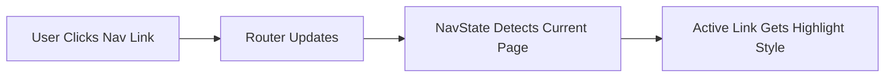

# PlexMix Frontend Visual Polish Plan

## Overview
This plan focuses on improving the visual consistency and professional appearance of the PlexMix web UI. The goal is to make the UI look more polished and cohesive while maintaining all existing functionality.

---

## Current State Analysis

### Identified Issues

#### 1. Navigation
- No active page indicator in sidebar
- Hover states are basic
- No visual feedback when navigating

#### 2. Spacing & Layout
- Inconsistent padding across pages (some use `padding="4"`, others `padding="6"`)
- Card margins vary between sections
- Grid gaps not standardized

#### 3. Cards & Containers
- Status cards on dashboard lack subtle shadows
- Border styles inconsistent (some have borders, some don't)
- Card hover effects missing or inconsistent

#### 4. Forms & Inputs
- No focus ring styles beyond defaults
- Missing validation state colors
- Inconsistent input widths

#### 5. Tables
- No zebra striping for readability
- Row hover states vary by page
- Header styling inconsistent

#### 6. Buttons
- Color usage not fully hierarchical
- Disabled states could be more visible
- Hover transitions are instant (no smooth animation)

#### 7. Status Indicators
- Badge colors not consistent
- Loading spinners vary in size
- Progress bars lack rounded ends

---

## Implementation Plan

### Phase 1: Foundation - CSS Design System

Create a consistent design system in [`assets/styles.css`](assets/styles.css:1):

```css
/* Spacing scale */
--space-1: 4px;
--space-2: 8px;
--space-3: 12px;
--space-4: 16px;
--space-6: 24px;
--space-8: 32px;

/* Border radius */
--radius-sm: 4px;
--radius-md: 8px;
--radius-lg: 12px;

/* Shadows */
--shadow-sm: 0 1px 2px rgba(0,0,0,0.05);
--shadow-md: 0 4px 6px rgba(0,0,0,0.1);
--shadow-lg: 0 10px 15px rgba(0,0,0,0.1);

/* Transitions */
--transition-fast: 150ms ease;
--transition-normal: 250ms ease;
```

### Phase 2: Navigation Improvements

Update [`navbar.py`](src/plexmix/ui/components/navbar.py:1):

1. Add active page detection using `rx.State`
2. Highlight current page with accent color background
3. Add left border indicator for active state
4. Improve hover animations with smooth transitions



### Phase 3: Card Component Standardization

Create consistent card patterns:

1. **Info Cards** - For displaying stats
   - Light background
   - Subtle shadow on hover
   - Consistent padding

2. **Action Cards** - For interactive content
   - Elevated shadow
   - Hover lift effect
   - Clear CTA styling

3. **Status Cards** - For configuration status
   - Icon + text alignment
   - Color-coded borders based on status

### Phase 4: Form Input Enhancements

Improve form elements in settings and filters:

1. Add custom focus ring styles (orange accent)
2. Error state: red border + icon
3. Success state: green checkmark
4. Consistent label spacing and typography
5. Input group styling for related fields

### Phase 5: Table Improvements

Enhance [`track_table.py`](src/plexmix/ui/components/track_table.py:1):

1. Add alternating row backgrounds
2. Sticky header for long tables
3. Improved checkbox alignment
4. Column header sorting indicators
5. Row hover with subtle background change

### Phase 6: Button Hierarchy

Establish clear button priority:

| Priority | Style | Use Case |
|----------|-------|----------|
| Primary | Solid orange | Main action (Save, Generate) |
| Secondary | Soft/Outline | Alternative actions |
| Tertiary | Ghost | Minor actions, navigation |
| Destructive | Red solid/soft | Delete, cancel operations |

### Phase 7: Loading & Progress States

Enhance feedback components:

1. Skeleton loaders with shimmer animation
2. Progress bars with gradient fill
3. Spinner with pulse animation
4. Loading overlay for page transitions

### Phase 8: Dark Mode Refinements

Review contrast and colors:

1. Ensure all text meets WCAG AA contrast
2. Reduce harsh blacks to softer grays
3. Add subtle borders in dark mode
4. Improve focus visibility

---

## Component-Specific Changes

### Dashboard Page
- Add gradient or pattern to hero area
- Improve stat cards with icons
- Add hover lift to action buttons
- Better visual separation between sections

### Generator Page
- Styled textarea with character count
- Example query chips with hover effect
- Results section with better visual hierarchy
- Playlist track numbers styled

### Library Page
- Filter pills with active state
- Track count badge styling
- Selection indicator improvements
- Pagination controls enhancement

### Settings Page
- Tab indicator animation
- Section dividers
- Inline validation feedback
- Better toggle switch styling

### History Page
- Playlist card image placeholders
- Hover overlay with actions
- Sort controls styling
- Empty state illustration

### Tagging Page
- Progress section with steps
- Tag display as badges
- Edit mode transitions
- Success state feedback

### Doctor Page
- Issue severity visual indicators
- Fix progress animations
- Health check visual states
- Action button grouping

---

## Files to Modify

| File | Changes |
|------|---------|
| `assets/styles.css` | Add design tokens, component classes |
| `src/plexmix/ui/components/navbar.py` | Active state, transitions |
| `src/plexmix/ui/components/track_table.py` | Zebra striping, hover |
| `src/plexmix/ui/components/progress_modal.py` | Better styling |
| `src/plexmix/ui/components/loading.py` | Enhanced skeletons |
| `src/plexmix/ui/components/error.py` | Consistent error cards |
| `src/plexmix/ui/pages/dashboard.py` | Card improvements |
| `src/plexmix/ui/pages/generator.py` | Form and results polish |
| `src/plexmix/ui/pages/library.py` | Filter and table updates |
| `src/plexmix/ui/pages/settings.py` | Tab and form styling |
| `src/plexmix/ui/pages/history.py` | Card grid improvements |
| `src/plexmix/ui/pages/tagging.py` | Progress and tag styling |
| `src/plexmix/ui/pages/doctor.py` | Status visual improvements |

---

## Success Criteria

- [ ] All pages use consistent spacing scale
- [ ] Navigation clearly shows current page
- [ ] Cards have consistent styling across pages
- [ ] Forms show clear focus and validation states
- [ ] Tables are readable with hover feedback
- [ ] Buttons follow clear hierarchy
- [ ] Loading states are smooth and informative
- [ ] Dark mode has proper contrast
- [ ] Transitions feel smooth and intentional

---

## Notes

- Avoid breaking existing functionality
- Test in both light and dark modes
- Consider performance of CSS animations
- Maintain accessibility (focus visibility, color contrast)